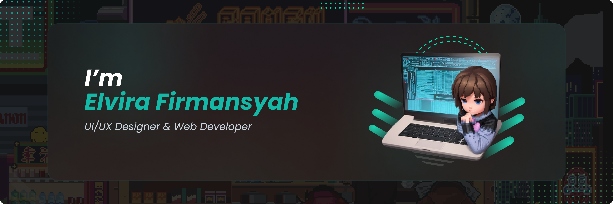

##  Hi👋 I'm Elvira 

```javascript
const about_me = () => {
  const profile = {
    name: "Elvira Firmansyah",
    pronouns: "she" | "her",
    nation: "Indonesia",
    site: "https://elvira.vercel.app"
  }

  return (
    <p>{`Hello, I'm ${profile.name}. I am a Web developer & UI/UX Designer from ${profile.nation}. Check it out my ${profile.site}`}</p>
  )
}

export default about_me;
```

Contact me if you have same interesting or some questions!


## 📫  How To Reach Me
<p>
 <a href="https://mail.google.com/mail/u/0/?fs=1&tf=cm&to=elvirafirmansyah.com" target="_blank"></a>
<a href="https://github.com/elvirafimansyah" target="_blank"></a> 
 <a href="https://www.instagram.com/virmoree/" target="_blank"></a>
 <a href="https://dribbble.com/ElviraFir" target="_blank"></a>
<a href="https://www.linkedin.com/in/elvira-firmansyah-6a1899232/" target="_blank"></a>

</p>

## 💻 Tech Stack
<p>


</p>

## ☕ Support Me
<p>
<a href="https://www.buymeacoffee.com/elvira"></a>
</p>
 
<!-- ## 💻 Open Source Work Stats


<p align="center">  -->