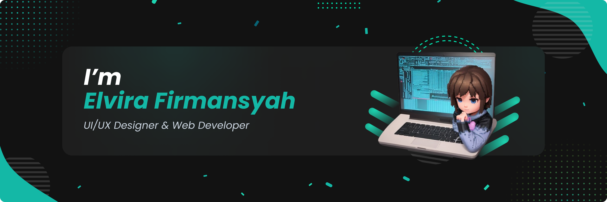

## 👋 Hi There, I'm Elvira 
  [](https://github.com/elvirafimansyah/?tab=follow) 



Hello, I'm **Elvira Firmansyah**. I am a **Web developer** & **UI/UX Designer** from Indonesia. I'm currently freelancer as a **UI/UX Designer**.  Check it out my    <a href="https://elvira.vercel.app">**site**</a>

### 🔨 I'm currently 
```text
working on my personal site
```
Contact me if you have same interesting or some questions!


## 📫  How To Reach Me
<p>
 <a href="https://mail.google.com/mail/u/0/?fs=1&tf=cm&to=freddyfirmansyah25@gmail.com" target="_blank"></a>
<a href="https://github.com/elvirafimansyah" target="_blank"></a> 
<a href="https://twitter.com/elvirafirmansy1" target="_blank"></a>
 <a href="https://www.instagram.com/elvinaelvira.s/" target="_blank"></a>
 <a href="https://dribbble.com/ElviraFir" target="_blank"></a>
 <a href="https://open.spotify.com/user/vdmfdxf0gtpooswibu1m9t49u" target="_blank"></a>
 <a href="https://discord.gg/696362999392239709" target="_blank"></a>
</p>

## ✨ Things I code With
<p>


</p>

## ☕ Support Me
<p>
<a href="https://www.buymeacoffee.com/elvira"></a>
</p>
 
## 💻 Open Source Work Stats


<p align="center"> 

